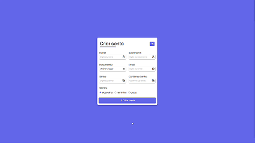

# Projeto Formulário

Aplicação de exemplo para criação e validação de formulários web. Inclui validação de campos, feedback visual e envio (simulado) dos dados.

## Funcionalidades

- Campos de formulário com validação (ex.: email, nome, CPF).
- Feedback visual de erros e sucessos.

## Tech Stack

- Front-end: HTML, CSS, JavaScript
- Deploy: GitHub Pages

## Contato

Email: <leonardopinheirosilva16@gmail.com>

LinkedIn: <https://www.linkedin.com/in/leonardo-pinheiro-13ba26281/>

Clique [aqui](https://leopinheirosilva.github.io/projeto-formulario/) para acessar o site!
